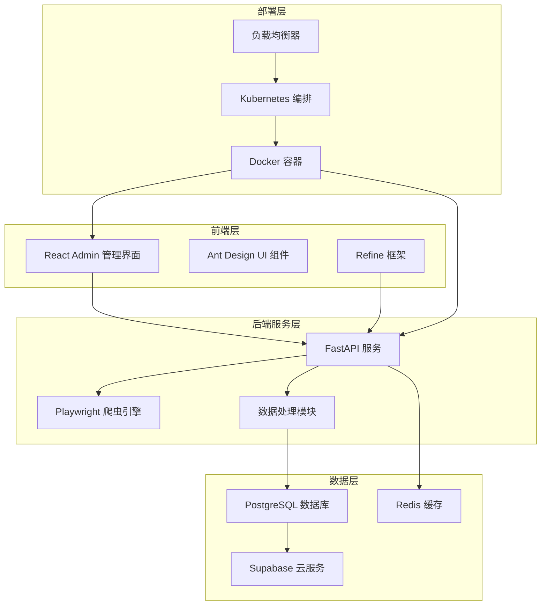
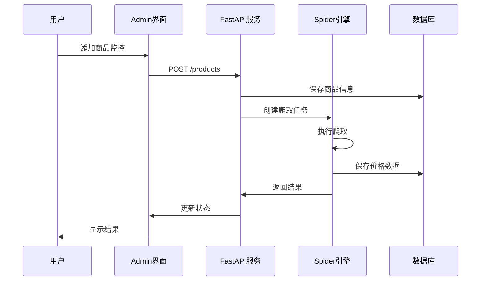
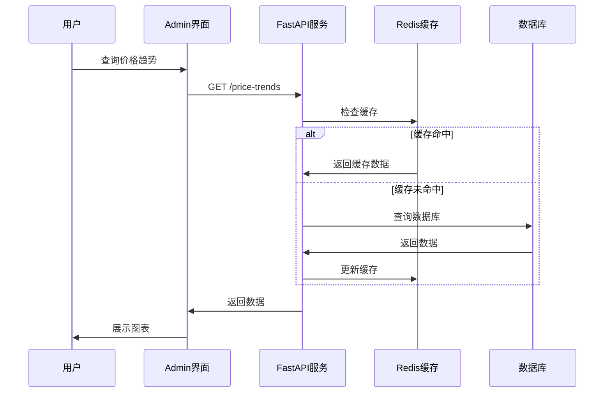

# Price Memory 架构设计

## 系统架构概览

Price Memory 采用现代化的微服务架构，将系统分为前端管理界面、后端爬虫服务和数据存储层三个主要部分。



## 模块详细设计

### 1. 前端管理模块 (admin/)

#### 技术栈
- **React 19**: 现代化的前端框架
- **TypeScript**: 类型安全的开发体验
- **Vite**: 快速的构建工具
- **Refine**: 企业级管理后台框架
- **Ant Design**: 专业的UI组件库

#### 目录结构
```
admin/
├── src/
│   ├── components/          # 通用组件
│   │   └── header/         # 头部组件
│   ├── contexts/           # React Context
│   │   └── color-mode/     # 主题模式管理
│   ├── App.tsx            # 应用入口
│   └── index.tsx          # 渲染入口
├── public/                # 静态资源
├── package.json           # 依赖配置
└── vite.config.ts         # 构建配置
```

#### 核心功能模块
1. **数据展示**: 商品价格趋势图表
2. **爬虫管理**: 爬虫任务配置和监控
3. **用户管理**: 用户权限和设置
4. **系统监控**: 系统状态和性能指标

### 2. 后端爬虫模块 (spider/)

#### 技术栈
- **Python 3.14+**: 现代Python版本
- **FastAPI**: 高性能异步Web框架
- **Playwright**: 现代化浏览器自动化工具
- **Ruff**: 快速的Python代码检查工具

#### 目录结构
```
spider/
├── main.py               # 应用入口
├── pyproject.toml        # 项目配置
├── README.md            # 模块说明
└── uv.lock              # 依赖锁定文件
```

#### 核心功能模块
1. **爬虫引擎**: 基于Playwright的网页抓取
2. **数据处理**: 价格数据清洗和标准化
3. **任务调度**: 定时爬取任务管理
4. **API服务**: RESTful API接口

### 3. 数据存储层

#### 数据库设计
- **PostgreSQL**: 主数据库，存储结构化数据
- **Supabase**: 云端数据库服务，提供实时同步
- **Redis**: 缓存层，提升查询性能

#### 数据模型设计
```sql
-- 商品表
CREATE TABLE products (
    id SERIAL PRIMARY KEY,
    name VARCHAR(255) NOT NULL,
    url TEXT NOT NULL,
    category VARCHAR(100),
    created_at TIMESTAMP DEFAULT CURRENT_TIMESTAMP
);

-- 价格记录表
CREATE TABLE price_records (
    id SERIAL PRIMARY KEY,
    product_id INTEGER REFERENCES products(id),
    price DECIMAL(10,2) NOT NULL,
    currency VARCHAR(10) DEFAULT 'CNY',
    recorded_at TIMESTAMP DEFAULT CURRENT_TIMESTAMP
);

-- 爬虫任务表
CREATE TABLE spider_tasks (
    id SERIAL PRIMARY KEY,
    product_id INTEGER REFERENCES products(id),
    status VARCHAR(20) DEFAULT 'pending',
    scheduled_at TIMESTAMP,
    completed_at TIMESTAMP
);
```

## 数据流设计

### 1. 数据采集流程


### 2. 数据查询流程


## 安全架构

### 1. 认证授权
- JWT Token 认证
- RBAC 角色权限控制
- API 访问频率限制

### 2. 数据安全
- 数据库连接加密
- 敏感信息环境变量存储
- 定期数据备份

### 3. 网络安全
- HTTPS 强制加密
- CORS 跨域控制
- 防SQL注入机制

## 性能优化

### 1. 前端优化
- 代码分割和懒加载
- 组件缓存和记忆化
- 图片压缩和CDN加速

### 2. 后端优化
- 异步处理和并发控制
- 数据库索引优化
- Redis缓存策略

### 3. 部署优化
- Docker容器化部署
- Kubernetes自动扩缩容
- 负载均衡和故障转移

## 监控和日志

### 1. 应用监控
- 性能指标收集
- 错误日志记录
- 用户行为分析

### 2. 基础设施监控
- 服务器资源监控
- 数据库性能监控
- 网络状态监控

### 3. 告警机制
- 异常情况自动告警
- 性能阈值监控
- 服务可用性检查