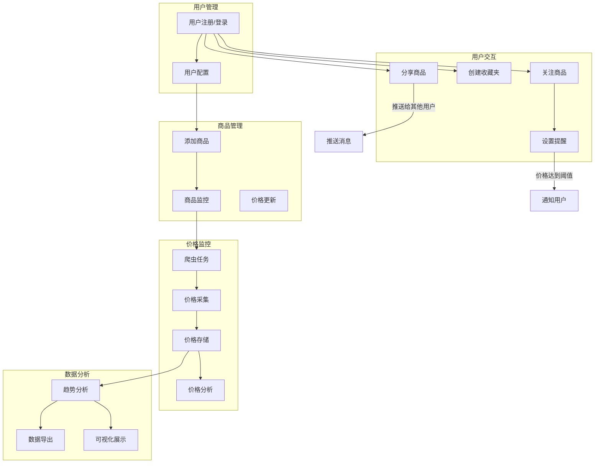

# Price Memory 数据库设计详解

## 项目背景与业务需求分析

Price Memory（价格记忆）是一个智能价格监控系统，核心目标是帮助用户追踪商品价格变化，做出更明智的购买决策。通过深入分析项目需求，我们识别出以下核心业务场景：

### 核心业务场景

1. **商品价格监控**：用户添加商品，系统定期抓取价格变化
2. **价格提醒服务**：用户设置价格阈值，达到条件时自动通知
3. **社交分享功能**：用户之间分享商品信息和价格发现
4. **协作收藏功能**：多用户协作管理商品收藏夹
5. **数据分析导出**：价格趋势分析和数据导出
6. **爬虫任务管理**：自动化的数据采集和任务调度

## 数据库架构设计原则

### 1. 业务驱动设计
- **用户中心**：以用户为核心，所有功能围绕用户需求展开
- **数据完整性**：确保价格数据的准确性和历史记录的完整性
- **扩展性优先**：支持未来功能扩展和业务增长

### 2. 性能优化考虑
- **读写分离**：价格数据读多写少，优化查询性能
- **索引策略**：为高频查询字段建立合适的索引
- **数据分区**：为大数据量表考虑分区策略

### 3. 安全性设计
- **行级安全**：使用 Supabase RLS 确保数据访问安全
- **权限分离**：不同角色具有不同的数据访问权限
- **数据隔离**：用户私有数据与公共数据严格分离

## 详细表结构设计

### 核心业务表

#### 1. products（商品表）
```sql
CREATE TABLE products (
    id SERIAL PRIMARY KEY,
    name TEXT NOT NULL,                    -- 商品名称
    url TEXT NOT NULL,                     -- 商品链接
    category TEXT,                         -- 商品分类
    last_updated TIMESTAMP WITH TIME ZONE DEFAULT NOW(),  -- 最后更新时间
    created_at TIMESTAMP WITH TIME ZONE DEFAULT NOW()     -- 创建时间
);
```

**设计考虑：**
- `url` 字段存储商品的原始链接，支持多平台商品监控
- `category` 字段支持商品分类，便于用户筛选和管理
- `last_updated` 记录最后一次价格更新时间，用于判断数据新鲜度
- 使用 `TIMESTAMP WITH TIME ZONE` 确保时区一致性

#### 2. prices（价格记录表）
```sql
CREATE TABLE prices (
    id SERIAL PRIMARY KEY,
    product_id INTEGER NOT NULL REFERENCES products(id) ON DELETE CASCADE,
    price DECIMAL(10,2) NOT NULL,          -- 价格（精确到分）
    currency VARCHAR(10) DEFAULT 'CNY',    -- 货币类型
    created_at TIMESTAMP WITH TIME ZONE DEFAULT NOW()
);
```

**设计考虑：**
- 使用 `DECIMAL(10,2)` 确保价格精度，避免浮点数误差
- `currency` 字段支持多货币，为国际化做准备
- `CASCADE` 删除策略确保数据一致性
- 时间戳用于价格趋势分析和图表绘制

#### 3. users（用户表）
```sql
CREATE TABLE users (
    id SERIAL PRIMARY KEY,
    username TEXT NOT NULL UNIQUE,         -- 用户名（唯一）
    display_name TEXT,                     -- 显示名称
    email TEXT UNIQUE,                     -- 邮箱（唯一）
    avatar_url TEXT,                       -- 头像链接
    created_at TIMESTAMP WITH TIME ZONE DEFAULT NOW()
);
```

**设计考虑：**
- `username` 和 `email` 都设置唯一约束，支持多种登录方式
- `display_name` 允许用户自定义显示名称
- `avatar_url` 支持用户头像，提升用户体验

### 功能扩展表

#### 4. user_follows（用户关注表）
```sql
CREATE TABLE user_follows (
    id SERIAL PRIMARY KEY,
    user_id INTEGER NOT NULL REFERENCES users(id) ON DELETE CASCADE,
    product_id INTEGER NOT NULL REFERENCES products(id) ON DELETE CASCADE,
    created_at TIMESTAMP WITH TIME ZONE DEFAULT NOW(),
    UNIQUE(user_id, product_id)            -- 防止重复关注
);
```

**设计考虑：**
- 多对多关系表，连接用户和商品
- `UNIQUE` 约束防止用户重复关注同一商品
- `CASCADE` 删除确保数据一致性

#### 5. alerts（价格提醒表）
```sql
CREATE TABLE alerts (
    id SERIAL PRIMARY KEY,
    user_id INTEGER NOT NULL REFERENCES users(id) ON DELETE CASCADE,
    product_id INTEGER NOT NULL REFERENCES products(id) ON DELETE CASCADE,
    rule_type TEXT NOT NULL,               -- 提醒类型：price_drop, price_target, percent_drop
    threshold DECIMAL(10,2),               -- 价格阈值
    percent DECIMAL(5,2),                  -- 百分比阈值
    status TEXT NOT NULL DEFAULT 'active', -- 提醒状态：active, triggered, disabled
    created_at TIMESTAMP WITH TIME ZONE DEFAULT NOW(),
    updated_at TIMESTAMP WITH TIME ZONE DEFAULT NOW()
);
```

**设计考虑：**
- 支持多种提醒规则：绝对价格、价格下降、百分比变化
- `threshold` 和 `percent` 字段根据 `rule_type` 选择性使用
- `status` 字段管理提醒的生命周期

### 社交协作表

#### 6. collections（收藏夹表）
```sql
CREATE TABLE collections (
    id SERIAL PRIMARY KEY,
    name TEXT NOT NULL,                    -- 收藏夹名称
    owner_user_id INTEGER NOT NULL REFERENCES users(id) ON DELETE CASCADE,
    description TEXT,                      -- 收藏夹描述
    is_public BOOLEAN NOT NULL DEFAULT FALSE,  -- 是否公开
    created_at TIMESTAMP WITH TIME ZONE DEFAULT NOW()
);
```

**设计考虑：**
- 支持私有和公开收藏夹，满足不同分享需求
- `owner_user_id` 明确所有权关系
- `description` 字段帮助用户组织和描述收藏内容

#### 7. collection_members（收藏夹成员表）
```sql
CREATE TABLE collection_members (
    id SERIAL PRIMARY KEY,
    collection_id INTEGER NOT NULL REFERENCES collections(id) ON DELETE CASCADE,
    user_id INTEGER NOT NULL REFERENCES users(id) ON DELETE CASCADE,
    role TEXT NOT NULL DEFAULT 'editor',   -- 角色：owner, editor, viewer
    joined_at TIMESTAMP WITH TIME ZONE DEFAULT NOW(),
    UNIQUE(collection_id, user_id)
);
```

**设计考虑：**
- 支持多种角色权限：所有者、编辑者、查看者
- 实现细粒度的权限控制
- 支持协作编辑功能

#### 8. pools（商品池表）
```sql
CREATE TABLE pools (
    id SERIAL PRIMARY KEY,
    name TEXT NOT NULL UNIQUE,             -- 商品池名称（全局唯一）
    is_public BOOLEAN NOT NULL DEFAULT FALSE,
    description TEXT,
    created_at TIMESTAMP WITH TIME ZONE DEFAULT NOW()
);
```

**设计考虑：**
- 商品池是更大范围的商品组织方式
- 支持公共商品池，如"热门电子产品"
- 全局唯一名称便于引用和管理

### 系统管理表

#### 9. tasks（爬虫任务表）
```sql
CREATE TABLE tasks (
    id SERIAL PRIMARY KEY,
    product_id INTEGER REFERENCES products(id) ON DELETE SET NULL,
    status TEXT NOT NULL DEFAULT 'pending', -- 任务状态：pending, running, completed, failed
    created_at TIMESTAMP WITH TIME ZONE DEFAULT NOW(),
    updated_at TIMESTAMP WITH TIME ZONE DEFAULT NOW(),
    scheduled_at TIMESTAMP WITH TIME ZONE,  -- 计划执行时间
    started_at TIMESTAMP WITH TIME ZONE,    -- 实际开始时间
    completed_at TIMESTAMP WITH TIME ZONE,  -- 完成时间
    result_message TEXT                     -- 执行结果消息
);
```

**设计考虑：**
- 完整的任务生命周期管理
- 支持定时任务调度
- `SET NULL` 策略允许任务独立于商品存在
- 详细的时间戳记录便于性能分析

#### 10. pushes（推送记录表）
```sql
CREATE TABLE pushes (
    id SERIAL PRIMARY KEY,
    sender_id INTEGER NOT NULL REFERENCES users(id) ON DELETE CASCADE,
    recipient_id INTEGER NOT NULL REFERENCES users(id) ON DELETE CASCADE,
    product_id INTEGER NOT NULL REFERENCES products(id) ON DELETE CASCADE,
    message TEXT,                          -- 推送消息
    status TEXT NOT NULL DEFAULT 'pending', -- 推送状态：pending, sent, read, accepted, rejected
    created_at TIMESTAMP WITH TIME ZONE DEFAULT NOW(),
    updated_at TIMESTAMP WITH TIME ZONE DEFAULT NOW()
);
```

**设计考虑：**
- 支持用户间的商品分享
- 完整的推送状态管理
- 自定义消息内容

## 索引设计策略

### 主要索引
```sql
-- 商品相关索引
CREATE INDEX idx_products_category ON products(category);
CREATE INDEX idx_products_url ON products(url);

-- 价格查询优化
CREATE INDEX idx_prices_product_id ON prices(product_id);
CREATE INDEX idx_prices_created_at ON prices(created_at);
CREATE INDEX idx_prices_product_time ON prices(product_id, created_at);

-- 用户关注查询优化
CREATE INDEX idx_user_follows_user_id ON user_follows(user_id);
CREATE INDEX idx_user_follows_product_id ON user_follows(product_id);

-- 提醒查询优化
CREATE INDEX idx_alerts_user_id ON alerts(user_id);
CREATE INDEX idx_alerts_product_id ON alerts(product_id);
CREATE INDEX idx_alerts_status ON alerts(status);

-- 任务管理优化
CREATE INDEX idx_tasks_status ON tasks(status);
CREATE INDEX idx_tasks_scheduled_at ON tasks(scheduled_at);
```

**索引设计原则：**
1. **高频查询优先**：为最常用的查询条件建立索引
2. **复合索引**：为多字段查询建立复合索引
3. **覆盖索引**：减少回表查询，提升性能
4. **避免过度索引**：平衡查询性能和写入性能

## 数据完整性约束

### 外键约束
- 所有关联表都使用外键约束确保引用完整性
- 根据业务逻辑选择合适的删除策略（CASCADE, SET NULL, RESTRICT）

### 唯一性约束
- 防止重复关注：`user_follows(user_id, product_id)`
- 防止重复成员：`collection_members(collection_id, user_id)`
- 防止重复商品：`pool_products(pool_id, product_id)`

### 检查约束
```sql
-- 价格必须为正数
ALTER TABLE prices ADD CONSTRAINT check_price_positive CHECK (price > 0);

-- 百分比在合理范围内
ALTER TABLE alerts ADD CONSTRAINT check_percent_range CHECK (percent IS NULL OR (percent >= 0 AND percent <= 100));

-- 状态值限制
ALTER TABLE tasks ADD CONSTRAINT check_task_status CHECK (status IN ('pending', 'running', 'completed', 'failed'));
```

## 安全性设计

### 行级安全策略（RLS）

#### 用户数据隔离
```sql
-- 用户只能访问自己的关注
CREATE POLICY "Users can manage own follows" ON user_follows
    FOR ALL USING (auth.uid()::text = user_id::text);

-- 用户只能管理自己的提醒
CREATE POLICY "Users can manage own alerts" ON alerts
    FOR ALL USING (auth.uid()::text = user_id::text);
```

#### 公共数据访问
```sql
-- 商品信息公开可读
CREATE POLICY "Products are viewable by everyone" ON products
    FOR SELECT USING (true);

-- 价格数据公开可读
CREATE POLICY "Prices are viewable by everyone" ON prices
    FOR SELECT USING (true);
```

#### 协作权限控制
```sql
-- 收藏夹基于所有权和公开性的访问控制
CREATE POLICY "Collection access control" ON collections
    FOR SELECT USING (
        is_public = true OR 
        auth.uid()::text = owner_user_id::text OR
        EXISTS (
            SELECT 1 FROM collection_members 
            WHERE collection_id = collections.id 
            AND user_id::text = auth.uid()::text
        )
    );
```

## 性能优化策略

### 1. 查询优化
- **分页查询**：使用 LIMIT/OFFSET 或游标分页
- **预计算**：为复杂统计查询建立物化视图
- **缓存策略**：热点数据使用 Redis 缓存

### 2. 数据归档
```sql
-- 历史价格数据分区（按月分区）
CREATE TABLE prices_y2024m01 PARTITION OF prices
    FOR VALUES FROM ('2024-01-01') TO ('2024-02-01');
```

### 3. 批量操作优化
- **批量插入**：价格数据批量写入
- **异步处理**：爬虫任务异步执行
- **连接池**：数据库连接池管理

## 扩展性考虑

### 1. 水平扩展
- **读写分离**：主从复制分离读写负载
- **分片策略**：按用户或商品分片
- **微服务拆分**：按业务域拆分服务

### 2. 功能扩展
- **多平台支持**：扩展商品来源
- **多语言支持**：国际化字段设计
- **API限流**：用户配额管理

### 3. 数据分析
- **OLAP支持**：数据仓库集成
- **实时分析**：流式数据处理
- **机器学习**：价格预测模型

## 监控与维护

### 1. 数据质量监控
- **价格异常检测**：识别异常价格变化
- **数据完整性检查**：定期验证数据一致性
- **性能监控**：查询性能和慢查询分析

### 2. 备份策略
- **定期备份**：每日全量备份
- **增量备份**：实时增量备份
- **跨区域备份**：灾难恢复准备

### 3. 维护任务
- **索引维护**：定期重建索引
- **统计信息更新**：保持查询优化器准确性
- **清理任务**：清理过期数据和日志

## 数据库关系图

### 核心实体关系图（ER图）

```mermaid
erDiagram
    USERS {
        int id PK
        text username UK
        text display_name
        text email UK
        text avatar_url
        timestamp created_at
    }
    
    PRODUCTS {
        int id PK
        text name
        text url
        text category
        timestamp last_updated
        timestamp created_at
    }
    
    PRICES {
        int id PK
        int product_id FK
        decimal price
        varchar currency
        timestamp created_at
    }
    
    USER_FOLLOWS {
        int id PK
        int user_id FK
        int product_id FK
        timestamp created_at
    }
    
    ALERTS {
        int id PK
        int user_id FK
        int product_id FK
        text rule_type
        decimal threshold
        decimal percent
        text status
        timestamp created_at
        timestamp updated_at
    }
    
    COLLECTIONS {
        int id PK
        text name
        int owner_user_id FK
        text description
        boolean is_public
        timestamp created_at
    }
    
    COLLECTION_PRODUCTS {
        int id PK
        int collection_id FK
        int product_id FK
        timestamp added_at
    }
    
    COLLECTION_MEMBERS {
        int id PK
        int collection_id FK
        int user_id FK
        text role
        timestamp joined_at
    }
    
    POOLS {
        int id PK
        text name UK
        boolean is_public
        text description
        timestamp created_at
    }
    
    POOL_PRODUCTS {
        int id PK
        int pool_id FK
        int product_id FK
        timestamp added_at
    }
    
    TASKS {
        int id PK
        int product_id FK
        text status
        timestamp created_at
        timestamp updated_at
        timestamp scheduled_at
        timestamp started_at
        timestamp completed_at
        text result_message
    }
    
    PUSHES {
        int id PK
        int sender_id FK
        int recipient_id FK
        int product_id FK
        text message
        text status
        timestamp created_at
        timestamp updated_at
    }

    %% 核心关系
    USERS ||--o{ USER_FOLLOWS : "用户关注商品"
    PRODUCTS ||--o{ USER_FOLLOWS : "商品被关注"
    PRODUCTS ||--o{ PRICES : "商品价格历史"
    
    %% 提醒关系
    USERS ||--o{ ALERTS : "用户设置提醒"
    PRODUCTS ||--o{ ALERTS : "商品价格提醒"
    
    %% 收藏夹关系
    USERS ||--o{ COLLECTIONS : "用户拥有收藏夹"
    COLLECTIONS ||--o{ COLLECTION"收藏夹包含商品"
    PRODUCTS ||--o{ COLLECTION_PRODUCTS : "商品在收藏夹中"
    COLLECTIONS ||--o{ COLLECTION_MEMBERS : "收藏夹成员"
    USERS ||--o{ COLLECTION_MEMBERS : "用户参与收藏夹"
    
    %% 商品池关系
    POOLS ||--o{ POOL_PRODUCTS : "商品池包含商品"
    PRODUCTS ||--o{ POOL_PRODUCTS : "商品在商品池中"
    
    %% 任务关系
    PRODUCTS ||--o{ TASKS : "商品爬虫任务"
    
    %% 推送关系
    USERS ||--o{ PUSHES : "用户发送推送"
    USERS ||--o{ PUSHES : "用户接收推送"
    PRODUCTS ||--o{ PUSHES : "推送商品信息"
```

### 业务流程关系图



## 设计决策说明

### 1. 为什么选择这样的表结构？

#### 核心表设计
- **products 表**：作为系统的核心实体，存储商品基本信息。选择 `url` 作为商品的唯一标识源，因为同一个商品在不同平台可能有不同的URL，但我们需要支持多平台监控。

- **prices 表**：独立的价格历史表，支持时间序列分析。使用 `DECIMAL` 类型确保价格精度，避免浮点数计算误差。

- **users 表**：用户信息表，支持多种登录方式（用户名、邮箱）。预留 `avatar_url` 字段提升用户体验。

#### 关系表设计
- **user_follows**：多对多关系表，实现用户关注商品功能。使用复合唯一约束防止重复关注。

- **alerts**：价格提醒表，支持多种提醒规则（绝对价格、价格下降、百分比变化）。灵活的规则设计满足不同用户需求。

#### 协作功能表
- **collections** 和 **collection_members**：实现协作收藏功能。支持私有和公开收藏夹，以及细粒度的权限控制（所有者、编辑者、查看者）。

- **pools**：商品池概念，用于组织大范围的商品集合，如"热门电子产品"。与收藏夹的区别在于商品池更偏向于公共资源。

### 2. 为什么选择这样的字段类型？

#### 时间字段
- 统一使用 `TIMESTAMP WITH TIME ZONE`：确保时区一致性，支持全球用户。
- 区分 `created_at` 和 `updated_at`：便于审计和数据分析。

#### 价格字段
- 使用 `DECIMAL(10,2)`：确保价格精度，支持最高99,999,999.99的价格。
- 添加 `currency` 字段：为国际化做准备，支持多货币。

#### 状态字段
- 使用 `TEXT` 类型存储状态：便于扩展新状态，避免枚举类型的限制。
- 通过检查约束限制有效值：确保数据完整性。

### 3. 为什么选择这样的索引策略？

#### 查询优化
- **复合索引**：`(product_id, created_at)` 支持按商品查询价格历史的时间范围查询。
- **覆盖索引**：减少回表查询，提升查询性能。

#### 业务场景优化
- **用户关注查询**：`user_id` 和 `product_id` 双向索引，支持"用户关注的商品"和"商品的关注者"查询。
- **任务调度优化**：`status` 和 `scheduled_at` 索引，支持任务调度器高效查询待执行任务。

### 4. 为什么选择这样的安全策略？

#### 行级安全（RLS）
- **数据隔离**：用户只能访问自己的私有数据（关注、提醒、私有收藏夹）。
- **公共数据开放**：商品信息和价格数据对所有用户开放，促进信息共享。
- **协作权限**：收藏夹支持基于成员关系的访问控制。

#### 删除策略
- **CASCADE**：用户删除时，相关的私有数据（关注、提醒）一并删除。
- **SET NULL**：商品删除时，相关任务保留但商品ID设为NULL，便于审计。

### 5. 为什么选择这样的扩展性设计？

#### 水平扩展
- **分片友好**：主要查询都基于用户ID或商品ID，便于按这些维度分片。
- **读写分离**：价格数据读多写少，适合主从复制架构。

#### 功能扩展
- **多平台支持**：商品表的设计支持任意平台的商品监控。
- **多货币支持**：价格表预留货币字段，支持国际化。
- **权限扩展**：角色字段使用文本类型，便于扩展新角色。

## 总结

这个数据库设计充分考虑了 Price Memory 项目的业务需求，在功能完整性、性能优化、安全性和扩展性之间取得了良好的平衡。设计的核心优势包括：

1. **业务驱动**：每个表和字段都有明确的业务价值
2. **关系清晰**：表间关系设计合理，支持复杂业务场景
3. **性能优化**：合理的索引策略和查询优化
4. **安全可靠**：完善的权限控制和数据保护
5. **易于扩展**：为未来功能扩展预留空间

通过这样的设计，Price Memory 能够高效地支持价格监控、用户协作、数据分析等核心功能，同时为未来的业务发展提供坚实的数据基础。